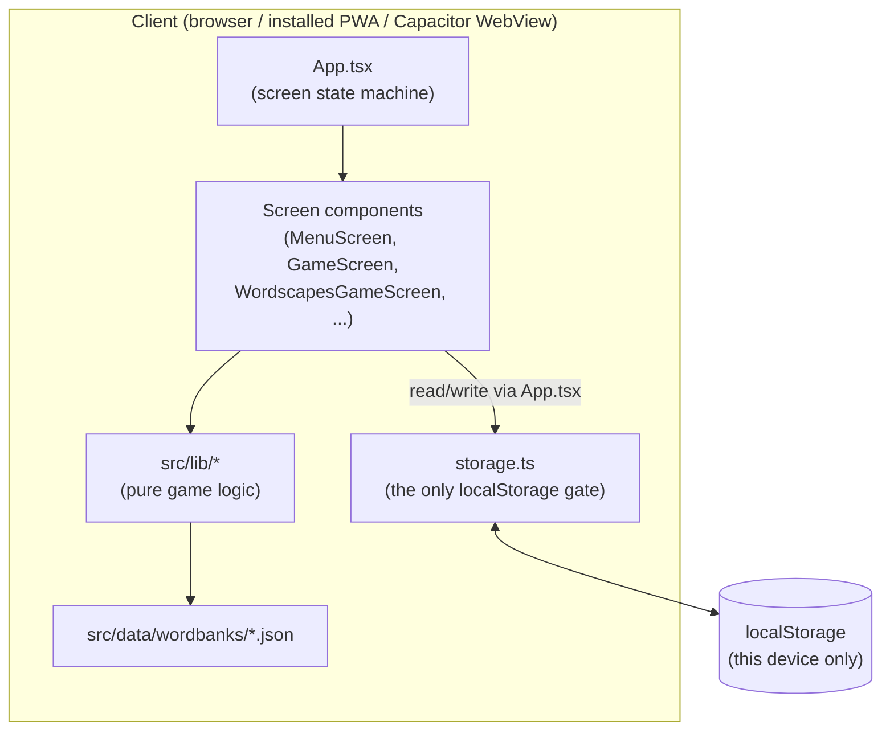
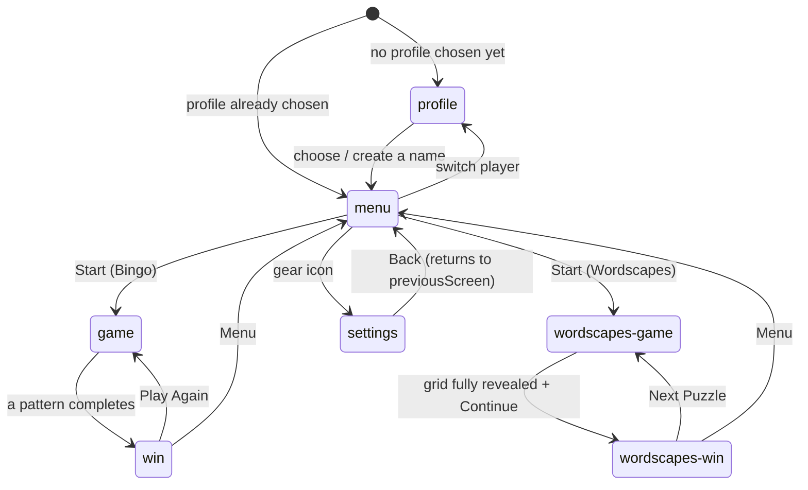

# Architecture

A high-level map of how Wordventure Bingo fits together — module
boundaries, data flow, and the screen state machine. This is the
"how it's shaped" companion to [`CLAUDE.md`](../CLAUDE.md), which carries
the per-feature "why it's shaped that way" rationale; when the two seem to
disagree, `CLAUDE.md` is the more detailed and more current source — update
both together, but treat this file as the diagram, not the spec.

## System shape



There is no backend and no network call after the first page load — every
box above lives in the client. `src/lib/storage.ts` is the single seam
between the app and browser storage; nothing else touches `localStorage`
directly (see [Data & persistence](#data--persistence)).

## Directory map

```
src/
  App.tsx              -- screen state machine; owns all cross-screen state
  main.tsx             -- ReactDOM root
  types.ts             -- shared TypeScript types (single source of truth)
  components/          -- one screen or widget per file + colocated .module.css
  lib/                  -- framework-free game logic, unit-tested
    cardGeneration.ts    -- Bingo: builds a 5x5 card from a word pool
    winDetection.ts       -- Bingo: row/col/diagonal/corners/blackout checks
    clueMatching.ts        -- Bingo: picks + formats a clue for a word
    caller.ts                -- Bingo: auto-caller queue + pace constants
    random.ts                 -- shared shuffle() etc., injectable rng
    storage.ts                 -- the only localStorage access point
    wordscapes/
      gridGeneration.ts          -- Wordscapes: puzzle generation + reveal logic
  hooks/                -- useSettings, useReducedMotion
  data/
    wordBanks.ts          -- registers each category's JSON word bank
    wordbanks/*.json        -- word + clue content, plain data, no build step
  test/rng.ts           -- seededRng/sequenceRng test helpers

docs/
  ARCHITECTURE.md       -- this file

scripts/
  dev.sh / dev.ps1      -- mirrored task runner (build/vet/test/cov/scan/...)
  run_web.* / run_window_mode.*  -- local launchers
  build_apk.sh / .ps1   -- local Android APK build (Capacitor)
  generate_icons.mjs    -- derives all app icons from assets/main-icon.jpg
```

`components/` and `lib/` are deliberately separate: `lib/` holds every rule
of the games themselves as plain, framework-free functions; `components/`
holds rendering and interaction only. A function belongs in `lib/` if you
could unit-test it without mounting anything.

## Screen state machine

`App.tsx` has no router — it's one `ScreenName` union swapped through
`AnimatePresence`, because the whole app is a handful of full-screen views,
not a document with URLs worth bookmarking.



Notes that aren't obvious from the diagram:

- **`profile` is a gate, not a normal destination.** `App.tsx`'s initial
  `screen` state is computed once from whether `getCurrentProfile()`
  already returns a name — a fresh device lands on `profile` with no way
  to dismiss it (`ProfileScreen`'s `onCancel` is only passed once a profile
  already exists); an existing device skips straight to `menu`.
- **`settings` remembers where it was opened from.** `openSettings` snapshots
  the current screen into `previousScreen` before switching, so `settings`
  can be reached from (and returns to) more than one place without a stack.
- Every screen transition is also a state transition in the sense that
  matters here: `App.tsx` decides *what data* the next screen needs (a
  `GameConfig`, a `WordscapesConfig`, a `WinInfo`) and only renders that
  screen once it has it (`screen === 'game' && gameConfig && (...)`) — see
  [Data flow](#data-flow).

## Data flow

`App.tsx` is the only component that holds cross-screen state — profile
identity, the active `GameConfig`/`WordscapesConfig`, win results, streaks,
and settings. Everything below it is a controlled view: a screen component
receives what it needs as props and calls a handler prop to report an
event back up. No screen re-derives or independently re-fetches state that
`App.tsx` already owns — components never re-read "the current profile"
from `storage.ts` themselves (see `CLAUDE.md`'s "Stack & architecture"
section).

```mermaid
sequenceDiagram
    participant Menu as MenuScreen
    participant App as App.tsx
    participant Game as GameScreen
    participant Storage as storage.ts

    Menu->>App: onStartBingo(config)
    App->>App: setGameConfig(config); setScreen('game')
    App->>Game: props: config, onWin, onExit
    Game->>Game: generateCard / buildCallQueue (lib/cardGeneration, lib/caller)
    Game->>App: onWin(patterns, winnerLabel)
    App->>Storage: recordGameResult(currentProfile, category, true)
    Storage-->>App: updated Streaks
    App->>App: setStreaks(...); setScreen('win')
```

The same shape repeats for Wordscapes (`WordscapesGameScreen` →
`onComplete(bonusWordsFound, assisted)` → `App.tsx` →
`recordWordscapesCompletion` → `setScreen('wordscapes-win')`) and for
profile selection (`ProfileScreen` → `onChoose(name)` → `App.tsx` calls
`createProfile`, then reloads that profile's `streaks`/`wordscapesStats`
before switching to `menu`).

## Data & persistence

Everything persistent lives in `localStorage`, gated entirely through
`src/lib/storage.ts` — that file is the only place in the codebase allowed
to call `localStorage` directly, so every read/write of app state is
grep-able from one file.

| What | Scope | Key(s) |
| --- | --- | --- |
| Settings (sound, reduce motion) | device-wide | `wordventure:settings` |
| Free Play custom word list | device-wide | `wordventure:freeplayWords` |
| Known player profile names | device-wide | `wordventure:profiles` |
| Active profile | device-wide | `wordventure:currentProfile` |
| Bingo streaks | per profile | `wordventure:streaks:<name>` |
| Wordscapes stats | per profile | `wordventure:wordscapesStats:<name>` |

**Player profiles are local labels, not accounts** — no auth, no server,
nothing that leaves the device. They exist purely so more than one player
on the same device/tablet gets separate Bingo streaks and Wordscapes stats;
settings and the Free Play word list intentionally stay device-wide (see
`CLAUDE.md`'s "Player profiles" section for the full rationale, including
how a device's pre-existing progress migrates into the first profile ever
created on it).

`storage.ts` functions that touch profile-scoped data take the profile name
as an explicit parameter (`getStreaks(profile)`, `recordGameResult(profile,
category, won)`, ...) rather than reading "the current profile" internally
— `App.tsx` holds the active profile in React state and passes it down, so
whose data a given call touches is always visible at the call site, not
hidden behind an implicit global.

## Game logic

Both games share the same shape: pure functions in `src/lib/` that take an
explicit `rng: () => number = Math.random` parameter, so tests can pass a
seeded/sequenced generator (`src/test/rng.ts`) instead of mocking
`Math.random` globally.

**Bingo** (`cardGeneration.ts` + `winDetection.ts` + `clueMatching.ts` +
`caller.ts`):
1. `selectWordPool` filters a category's word bank by difficulty (Free Play
   ignores difficulty and uses everything).
2. `generateCard` deals a shuffled 5x5 card (24 words + one FREE center).
3. `buildCallQueue` shuffles every word actually in play across all cards
   into a call order; `clueForWord` picks a clue type per call, weighted by
   difficulty (harder difficulties lean on riddle/anagram over plain
   definitions).
4. `checkWin` re-checks every standard pattern (row/column/diagonal/
   corners/blackout) on each mark and returns all patterns satisfied at
   once, since more than one can complete on the same tap.

**Wordscapes** (`wordscapes/gridGeneration.ts`) has no fixed level list —
every puzzle is generated on demand from the same word banks:
1. `selectWordscapesPool` layers a word-*length* cap on top of Bingo's
   difficulty filter (Wordscapes needs short words for a legible wheel;
   Bingo's difficulty tags are about vocabulary, not length).
2. A stratified, length-interleaved sample is placed into an interlocking
   grid (`generateLevel`), avoiding the same-length clustering a naive
   longest-first placement would produce.
3. The letter wheel is derived from the placed words' max per-letter
   counts; a random letter per word is pre-revealed as a free hint.
4. `revealWord` / `revealRandomLetter` / `revealAll` mutate the grid as the
   player solves or asks for help; `isLevelComplete` is checked after every
   change rather than tracked as a separate flag, so a puzzle finished by
   the player, by repeated hints, or by Give Up all converge on the same
   "show the review panel" state.

See `CLAUDE.md`'s "Bingo mode" and "Wordscapes mode" sections for the
detailed *why* behind each of these (bugs they fixed, tradeoffs made).

## Build & packaging

One web build (`vite build` → `dist/`) serves three different runtimes:

- **Browser / installed PWA** — `vite-plugin-pwa` generates the manifest +
  service worker directly from `dist/`; nothing else is needed.
- **Android APK** — `scripts/build_apk.sh`/`.ps1` run Capacitor, which
  copies `dist/` into a native Android project as local WebView assets and
  builds a debug-signed APK with Gradle. This needs no hosted URL (unlike
  the Bubblewrap/TWA approach it replaced), so it works from a plain
  checkout — see `CLAUDE.md`'s "Known open items" for why Capacitor won.
- **Windows** — no native package yet; `run_web`/`run_window_mode` scripts
  and a browser PWA install cover the desktop experience today.

The app icon has one source of truth, `assets/main-icon.jpg`; `npm run
icons` (`scripts/generate_icons.mjs`) derives the square master
(`assets/icon.png`) and every PWA manifest icon from it, and
`build_apk.sh`/`.ps1` additionally run `@capacitor/assets generate
--android` to regenerate the native launcher icon on every build (since
`android/` itself is fully regenerated and gitignored).

## Testing

Only `src/lib/` (game logic) is unit-tested — `src/lib/*.test.ts` and
`src/lib/wordscapes/*.test.ts`, using Vitest with the seeded-rng helpers in
`src/test/rng.ts`. Components/UI are verified manually in-browser rather
than with component tests, per `CLAUDE.md`'s testing conventions — the
logic that actually needs correctness guarantees (card generation, win
detection, clue selection, puzzle generation) is already framework-free and
sits entirely in `lib/`.
