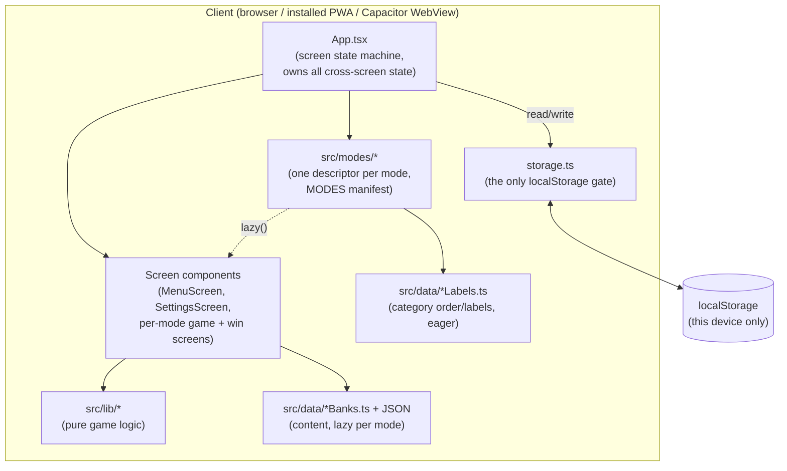

# Architecture

A high-level map of how Wordventure Bingo fits together — module
boundaries, data flow, and the screen state machine. This is the
"how it's shaped" companion to [`CLAUDE.md`](../CLAUDE.md), which carries
the per-feature "why it's shaped that way" rationale; when the two seem to
disagree, `CLAUDE.md` is the more detailed and more current source — update
both together, but treat this file as the diagram, not the spec.

## System shape



There is no backend and no network call after the first page load — every
box above lives in the client. `src/lib/storage.ts` is the single seam
between the app and browser storage, and `App.tsx` is the only component
that calls it (see [Data & persistence](#data--persistence)).

## Directory map

```
src/
  App.tsx              -- screen state machine; owns all cross-screen state
  main.tsx             -- ReactDOM root
  types.ts             -- shared TypeScript types (single source of truth)
  modes/               -- the mode registry (see "Modes" below)
    types.ts             -- ModeDescriptor contract + defineMode/bump helpers
    index.ts             -- MODES manifest (menu order) + modeById
    bingo.ts             -- one descriptor per mode; bingo.ts is the template
    wordscapes.ts
    sentenceQuest.ts
    synonymSafari.ts
    modes.test.ts        -- manifest invariants + each mode's stats arithmetic
  components/          -- one screen or widget per file + colocated .module.css
    ErrorBoundary.tsx    -- catches a screen crash; "Back to Menu" recovery
    OptionSection.tsx    -- the shared single-select chip group every menu section uses
    *MenuOptions.tsx     -- each mode's extra menu sections (players, word count, ...)
  lib/                  -- framework-free game logic, unit-tested
    cardGeneration.ts    -- Bingo: builds a 5x5 card from a word pool
    winDetection.ts       -- Bingo: row/col/diagonal/corners/blackout checks
    clueMatching.ts        -- Bingo: picks + formats a clue for a word
    caller.ts                -- Bingo: auto-caller queue + pace constants
    sentenceQuest.ts           -- Sentence Quest: round generation + grading
    synonymSafari.ts             -- Synonym Safari: round generation + matching
    random.ts                      -- shared shuffle() etc., injectable rng
    storage.ts                       -- the only localStorage access point
    wordscapes/
      gridGeneration.ts              -- Wordscapes: puzzle generation + reveal logic
  hooks/                -- useSettings, useReducedMotion, useAppearance
  data/
    wordBanks.ts          -- registers each category's JSON word bank (content only)
    wordBankLabels.ts     -- category menu order + labels, no JSON import
    wordbanks/*.json        -- word + clue content, plain data, no build step
    sentenceQuestBanks.ts  -- registers each category's JSON question bank
    sentenceQuestLabels.ts -- its category order + labels
    sentenceQuestBanks/*.json -- sentence/options/answer/explanation content
    synonymSafariBanks.ts  -- registers the synonym/antonym JSON pair banks
    synonymSafariLabels.ts -- its category order + labels
    synonymSafariBanks/*.json -- word/match/difficulty pair content
    banks.test.ts         -- structural invariants over every shipped bank
  test/rng.ts           -- seededRng/sequenceRng test helpers

docs/
  ARCHITECTURE.md       -- this file

scripts/
  dev.sh / dev.ps1      -- mirrored task runner (build/vet/test/cov/scan/...)
  run_web.* / run_window_mode.*  -- local launchers
  build_apk.sh / .ps1   -- local Android APK build (Capacitor)
  generate_icons.mjs    -- derives all app icons from assets/main-icon.jpg
```

`components/` and `lib/` are deliberately separate: `lib/` holds every rule
of the games themselves as plain, framework-free functions; `components/`
holds rendering and interaction only. A function belongs in `lib/` if you
could unit-test it without mounting anything. `modes/` sits between them:
each descriptor is plain data plus pure stats functions, and points at (but
does not contain) the mode's screens.

## Modes

Every game mode is a `ModeDescriptor<TConfig, TResult, TStats>`
(`src/modes/types.ts`) and the app's generic shell is written against the
type-erased `AnyMode`:

| Descriptor field | Consumed by | Purpose |
| --- | --- | --- |
| `id`, `label`, `emoji` | MenuScreen, SettingsScreen | mode chip, stats card title |
| `categories` | MenuScreen | category chips (static labels, no JSON) |
| `defaultConfig`, `MenuOptions`, `menuStatLine` | MenuScreen | the mode's draft config and extra sections |
| `GameScreen`, `WinScreen` (lazy) | App.tsx | what `game`/`win` render for this mode |
| `stats.key`, `stats.defaults` | App.tsx → storage.ts | the per-profile bucket and its shape |
| `stats.record`, `stats.recordAbandon?` | App.tsx | pure stats updates on finish / quit |
| `stats.summary` | SettingsScreen | the all-category aggregate card |

`src/modes/index.ts`'s `MODES` array is the manifest and the menu order.
**Adding a mode** is additive: write the descriptor (copy `bingo.ts`), its
screens (implementing `ModeGameScreenProps` / `ModeWinScreenProps`), its
`lib/` generator and `data/` banks + labels, add the id to the `GameMode`
union in `types.ts`, and add one line to `MODES`. `App.tsx`, `MenuScreen`,
`SettingsScreen` and `storage.ts` don't change. Disabling a mode is
commenting out its line.

`GameScreen`/`WinScreen` are `React.lazy`, and the `*Banks.ts` registries
are imported only from those screens, so each mode's content JSON ships in
that mode's chunk rather than the initial bundle (Sentence Quest's banks
alone are ~1 MB). The service worker precaches every chunk, so this changes
nothing offline. Whatever the menu needs before a mode is chosen — category
order and labels — lives in the small `*Labels.ts` maps instead; the
`banks.test.ts` gate asserts each static label matches its JSON.

## Screen state machine

`App.tsx` has no router — it's one `ScreenName` union swapped through
`AnimatePresence`, because the whole app is a handful of full-screen views,
not a document with URLs worth bookmarking. `game` and `win` are generic:
the active mode session decides which descriptor's screens they render.

```mermaid
stateDiagram-v2
    [*] --> profile: no profile chosen yet
    [*] --> menu: profile already chosen
    profile --> menu: choose / create a name
    menu --> profile: switch player
    menu --> game: Start (any mode; session = {mode, config})
    menu --> settings: gear icon
    game --> win: mode.GameScreen calls onComplete(result)
    game --> menu: Menu / hardware back (mode.stats.recordAbandon, if any)
    win --> game: Play Again / Next (same config)
    win --> menu: Menu
    settings --> menu: Back
```

Notes that aren't obvious from the diagram:

- **`profile` is a gate, not a normal destination.** `App.tsx`'s initial
  `screen` state is computed once from whether `getCurrentProfile()`
  already returns a name — a fresh device lands on `profile` with no way
  to dismiss it (`ProfileScreen`'s `onCancel` is only passed once a profile
  already exists); an existing device skips straight to `menu`.
- **`settings` is only reachable from `menu`**, so closing it always
  returns there — there is no "where was it opened from" bookkeeping.
- **The whole switcher sits inside `ErrorBoundary`.** A `src/lib`
  generator throwing (a data bug) renders the error text and a "Back to
  Menu" button instead of a blank page; recovery clears the session with
  no stats side effects.
- Every screen transition is also a state transition in the sense that
  matters here: `App.tsx` decides *what data* the next screen needs (a
  `Session` with the mode + its config, later its result) and only renders
  that screen once it has it (`screen === 'game' && session && ...`) — see
  [Data flow](#data-flow).

## Data flow

`App.tsx` is the only component that holds cross-screen state — profile
identity, the active mode `Session` (`{ mode, config, result }`), every
mode's stats (`statsByMode`), each mode's most recent round items
(`recentByMode`), the menu's current picks (`menuSelection` -- MenuScreen
is a controlled component), the Free Play word list, and settings. Everything below
it is a controlled view: a screen component receives what it needs as
props and calls a handler prop to report an event back up. No screen
re-derives or independently re-fetches state that `App.tsx` already owns —
components never read `storage.ts` themselves (see `CLAUDE.md`'s "Stack &
architecture" section).

```mermaid
sequenceDiagram
    participant Menu as MenuScreen
    participant App as App.tsx
    participant Game as mode.GameScreen
    participant Mode as mode descriptor
    participant Storage as storage.ts

    Menu->>App: onStart(mode, config)
    App->>App: setSession({mode, config}); setScreen('game')
    App->>Game: props: config, context, excludeItems, onRoundStart, onComplete, onExit
    Game->>Game: generate round (lib/*)
    Game->>App: onRoundStart(items)  -- stored in recentByMode[mode.id]
    Game->>App: onComplete(result)
    App->>Mode: stats.record(statsByMode[mode.id], config, result)
    Mode-->>App: updated stats (pure)
    App->>Storage: saveModeStats(mode.stats.key, profile, stats)
    App->>App: setStatsByMode(...); setSession({..., result}); setScreen('win')
```

The same sequence serves every mode — Bingo, Wordscapes, Sentence Quest and
Synonym Safari differ only in their `TConfig`/`TResult`/`TStats` shapes and
in what their descriptor's `record` does with them. Leaving `game` early
runs the same path through `stats.recordAbandon` when the mode defines one
(Bingo counts it as a loss). Profile selection (`ProfileScreen` →
`onChoose(name)`) has `App.tsx` call `createProfile`, then reload every
mode's stats for that name before switching to `menu`.

## Data & persistence

Everything persistent lives in `localStorage`, gated entirely through
`src/lib/storage.ts` — that file is the only place in the codebase allowed
to call `localStorage` directly, so every read/write of app state is
grep-able from one file. Every read validates the parsed JSON's shape and
falls back to the default (field-by-field for stats) rather than trusting
a corrupted or hand-edited value.

| What | Scope | Key(s) |
| --- | --- | --- |
| Settings (reduce motion, theme, font size) | device-wide | `wordventure:settings` |
| Free Play custom word list | device-wide | `wordventure:freeplayWords` |
| Known player profile names | device-wide | `wordventure:profiles` |
| Active profile | device-wide | `wordventure:currentProfile` |
| One stats record per mode | per profile | `wordventure:<mode.stats.key>:<name>` |
| Last menu picks (mode, difficulty, each mode's options) | per profile | `wordventure:menuSelection:<name>` |

The per-mode key segments are `streaks` (Bingo), `wordscapesStats`,
`sentenceQuestStats` and `synonymSafariStats` — the first two are pinned to
their pre-registry names so existing players' data still loads.

**Player profiles are local labels, not accounts** — no auth, no server,
nothing that leaves the device. They exist purely so more than one player
on the same device/tablet gets separate stats; settings and the Free Play
word list intentionally stay device-wide (see `CLAUDE.md`'s "Player
profiles" section for the full rationale, including how a device's
pre-existing progress migrates into the first profile ever created on it).

`storage.ts` functions that touch profile-scoped data take the profile name
as an explicit parameter (`getModeStats(key, profile, defaults)`,
`saveModeStats(key, profile, stats)`) rather than reading "the current
profile" internally — `App.tsx` holds the active profile in React state and
passes it down, so whose data a given call touches is always visible at
the call site, not hidden behind an implicit global. Stats *arithmetic*
lives in the mode descriptors, not in `storage.ts`, which only persists.

## Game logic

All four modes share the same shape: pure functions in `src/lib/` that
take an explicit `rng: () => number = Math.random` parameter, so tests can
pass a seeded/sequenced generator (`src/test/rng.ts`) instead of mocking
`Math.random` globally. None of them import content — the screen passes
the bank's words/questions/pairs in.

**Bingo** (`cardGeneration.ts` + `winDetection.ts` + `clueMatching.ts` +
`caller.ts`):
1. `selectWordPool` filters a category's word bank by difficulty (Free Play
   ignores difficulty and uses everything).
2. `generateCard` deals a shuffled 5x5 card (24 words + one FREE center).
3. `buildCallQueue` shuffles every word actually in play across all cards
   into a call order; `clueForWord` picks a clue type per call, weighted by
   difficulty (harder difficulties lean on riddle/anagram over plain
   definitions).
4. `checkWin` re-checks every standard pattern (row/column/diagonal/
   corners/blackout) on each mark and returns all patterns satisfied at
   once, since more than one can complete on the same tap.

**Wordscapes** (`wordscapes/gridGeneration.ts`) has no fixed level list —
every puzzle is generated on demand from the same word banks:
1. `selectWordscapesPool` layers a word-*length* cap on top of Bingo's
   difficulty filter (Wordscapes needs short words for a legible wheel;
   Bingo's difficulty tags are about vocabulary, not length).
2. A stratified, length-interleaved sample is placed into an interlocking
   grid (`generateLevel`), avoiding the same-length clustering a naive
   longest-first placement would produce. Sampling prefers words not in the
   caller-supplied `excludeWords` (the previous puzzle's words, passed down
   from `App.tsx` as `excludeItems`) as long as enough others remain, so
   consecutive puzzles don't repeat the same words.
3. The letter wheel is derived from the placed words' max per-letter
   counts; a random letter per word is pre-revealed as a free hint.
4. `revealWord` / `revealRandomLetter` / `revealAll` mutate the grid as the
   player solves or asks for help; `isLevelComplete` is checked after every
   change rather than tracked as a separate flag, so a puzzle finished by
   the player, by repeated hints, or by Give Up all converge on the same
   "show the review panel" state.

**Sentence Quest** (`sentenceQuest.ts`) has its own category set
(grammar concepts, not vocabulary themes) and its own question banks
(`src/data/sentenceQuestBanks/`), entirely separate from Bingo/Wordscapes':
1. `selectQuestionPool` filters a category's question bank by difficulty.
2. `generateRound` samples `questionCount` unique questions (preferring
   ones not in the caller-supplied `excludeSentences` — the previous
   round's questions — the same soft-preference pattern as Wordscapes'
   `excludeWords`) and shuffles each one's multiple-choice `options` order
   — grading is always by string equality against `answer`, never by array
   index, so the shuffle can never misgrade.
3. `isCorrect`/`splitSentence` are small pure helpers `SentenceQuestScreen`
   uses for grading and rendering the sentence around its blank.

**Synonym Safari** (`synonymSafari.ts`) has its own relation-based category
set (`synonyms | antonyms`, one bank file each, no combined "mixed" pool —
see `CLAUDE.md`'s "Synonym Safari mode" for why that was tried and dropped)
and its own pair banks (`src/data/synonymSafariBanks/`), entirely separate
from every other mode's content:
1. `selectSynonymSafariPool` filters a bank's pairs by difficulty.
2. `generateRound` samples `pairCount` pairs from a shuffled pool while
   tracking used `word`s *and* used `match`es, skipping anything that
   collides with either, so a bank can never accidentally deal two
   visually-identical cells. It also prefers skipping any `word` in the
   caller-supplied `excludeWords` set (the previous round's words, passed
   down from `App.tsx`), falling back to reusing them only if the pool is
   too small to avoid it — this is what keeps back-to-back rounds from
   repeating the same handful of words. Throws only if the pool can't fill
   a round even allowing repeats.
3. `checkMatch` grades a tapped word/match pair by plain string equality,
   safe because `generateRound` already guarantees no duplicate word/match
   within a round; `pickHintPair` uniformly picks a random still-unmatched
   pair for the repeatable hint button.

See `CLAUDE.md`'s "Bingo mode", "Wordscapes mode", "Sentence Quest mode",
and "Synonym Safari mode" sections for the detailed *why* behind each of
these (bugs they fixed, tradeoffs made).

## Build & packaging

One web build (`vite build` → `dist/`) serves three different runtimes:

- **Browser / installed PWA** — `vite-plugin-pwa` generates the manifest +
  service worker directly from `dist/`; nothing else is needed. The
  per-mode lazy chunks are part of the precache, so first load still
  fetches everything and later loads work fully offline.
- **Android APK** — `scripts/build_apk.sh`/`.ps1` run Capacitor, which
  copies `dist/` into a native Android project as local WebView assets and
  builds a debug-signed APK with Gradle. This needs no hosted URL (unlike
  the Bubblewrap/TWA approach it replaced), so it works from a plain
  checkout — see `CLAUDE.md`'s "Known open items" for why Capacitor won.
- **Windows** — no native package yet; `run_web`/`run_window_mode` scripts
  and a browser PWA install cover the desktop experience today.

The app icon has one source of truth, `assets/main-icon.jpg`; `npm run
icons` (`scripts/generate_icons.mjs`) derives the square master
(`assets/icon.png`) and every PWA manifest icon from it, and
`build_apk.sh`/`.ps1` additionally run `@capacitor/assets generate
--android` to regenerate the native launcher icon on every build (since
`android/` itself is fully regenerated and gitignored).

## Testing

Three kinds of unit test, all Vitest, all framework-free:

- **Game logic** — `src/lib/*.test.ts` and `src/lib/wordscapes/*.test.ts`,
  using the seeded-rng helpers in `src/test/rng.ts`: card generation, win
  detection, clue selection, puzzle generation, round generation/grading.
- **Mode registry** — `src/modes/modes.test.ts`: manifest invariants
  (unique ids/keys, historical storage keys pinned, defaults valid) and
  each mode's pure stats arithmetic, including Bingo's loss path.
- **Content banks** — `src/data/banks.test.ts`: every structural rule the
  shipped JSON must satisfy (word counts per tier, unique words, one blank
  and 4 options per question, unique sentences, no repeated match text
  within a tier, static-label ↔ JSON-label sync) plus a generation sweep
  proving every category/difficulty/word-count combination actually
  produces a card/puzzle/round. This is the structural pass only — new
  content still needs a human to read a sample (see `CLAUDE.md`).

Components/UI are verified manually in-browser rather than with component
tests, per `CLAUDE.md`'s testing conventions.
